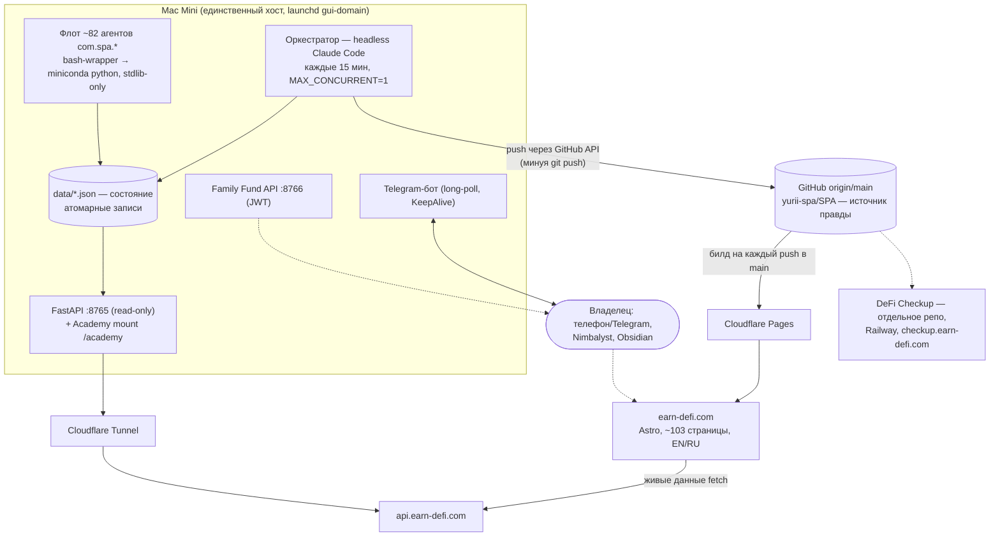
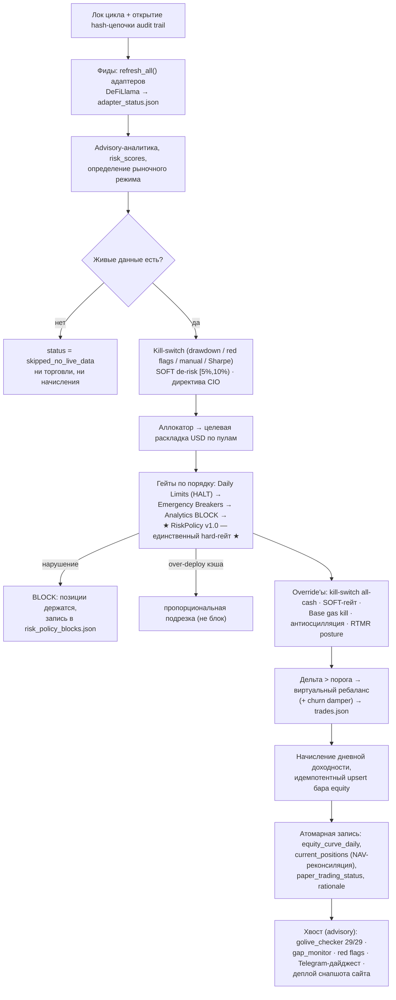

# SPA — Smart Passive Aggregator: архитектура системы

> **Инженерное досье для внешнего архитектора.** Составлено 2026-08-29 по состоянию репозитория
> (`docs/SYSTEM_MAP.md`, `PROJECT_CONTROL/`, `architecture/manifest.json`, `data/agent_registry.json`,
> исходный код `spa_core/` и `scripts/`, корпус ADR). Живые числа проверять по `docs/SYSTEM_BRIEFING.md`
> (авто-обновление каждые 30 минут). HTML-версия опубликована как Claude-артефакт «Архитектура SPA».

**Снимок:** репо `yurii-spa/SPA` (main) · виртуальный капитал $100 000 USDC · GoLive-гейт 29/29 PASS ·
трек 67 evidenced-дней · сайт earn-defi.com · API api.earn-defi.com.

---

## 1. Что это и на какой стадии

SPA — автономная система, которая каждый день берёт живые APY/TVL из whitelisted DeFi-протоколов,
прогоняет их через детерминированный риск-гейт и ребалансирует **виртуальный** портфель на $100 000 USDC.
Цель стадии — честный 30-дневный evidenced-трек, после которого владелец принимает решение о go-live
с реальным капиталом. Реальные деньги система не двигает: слой исполнения (`spa_core/execution/`)
существует как scaffold v2.0, но неактивен и закрыт мастер-гейтом `live_trading_gate` (OFF по умолчанию;
активация требует подписи владельца, ≥30 evidence-точек и PASS 38 pre-launch проверок).

Всё, что не входит в живой трек — исследовательские дески, sleeves, «рой», слой аналитиков
Investment-OS — работает в режиме **advisory**: производит выводы и доказательства, но капитал не трогает.

Проект ведёт один владелец; разработку выполняют сессии Claude Code (интерактивные и автономный
оркестратор). Управление — с телефона, через Telegram и файловые карточки. Финансовая модель —
`MASTER_PLAN_v1.md`; контрольная система — каталог `PROJECT_CONTROL/`.

## 2. Топология: как всё связано

Четыре внешних канала: **GitHub API** (доставка кода и контента), **Cloudflare** (Pages для сайта +
Tunnel для API), **Telegram** (управление и алерты), **файлы-карточки в git** (очередь владельца).
Ключевая особенность модели доставки: пуши идут в origin напрямую через GitHub API, поэтому локальное
дерево на Маке **по построению** дрейфует от origin — это штатно и охраняется отдельными сторожами (§8).

## 3. Сквозные инварианты

Правила закреплены в `CLAUDE.md`, повторены в docstring почти каждого модуля и принуждаются кодом
и тестами, а не только текстом.

| Инвариант | Чем принуждается |
|---|---|
| **RiskPolicy v1.0 — единственный hard-гейт.** `approved=False` не переопределяется никем; advisory-слои никогда не гейтят. | Единственная точка вызова в цикле; изменение порогов только через ADR; version-строка заморожена на весь paper-период. |
| **Fail-CLOSED / refusal-first.** Нет данных, расходятся фиды, не хватает истории — отказ или HOLD. Отсутствие наблюдения ≠ «всё хорошо» (ADR-129). | Ошибка внутри риск-гейта = BLOCK; `tvl_source != "live"` = нет свежего капитала; AST-храповик на паттерны `or 0.0` / `except: return ok`. |
| **LLM запрещён** в risk / execution / monitoring / kill-компонентах. | Маркеры `# LLM_FORBIDDEN`; `LLM_FORBIDDEN_AGENTS` в конфиге; проверка в CI proof-gate. |
| **Только stdlib** в рантайме (исключение — FastAPI/uvicorn для API). | conftest статически режет тесты с тяжёлыми зависимостями; CI ставит только pytest. |
| **Атомарные записи** всех state-файлов. | `atomic_save` (tmp в той же директории + `os.replace`) + guard от «мусорных» repr-путей. |
| **Секреты только в macOS Keychain** (PAT, Telegram-токены, JWT-секрет, CF-токен). | Политика после инцидента утечки PAT 2026-06-10 (токен попал в 90+ файлов). |
| **Файлы в git — единственный источник правды.** Nimbalyst, Obsidian, дашборды — только окна. | Files-first очередь карточек; производные индексы сверяются тестами с источником. |
| **Выход из позиций не блокируется никогда** (условие владельца). | `RiskCheckResult.blocks_exit` жёстко `False`; `ALL_CASH` только по явно названной причине. |
| **Запрещено молча ослаблять тесты.** | Изменение теста требует обоснования + записи в журнал; храповики допускают только уменьшение класса проблем. |
| **Никакого solicitation-языка на сайте**; каждое публичное число имеет источник, evidence-уровень (L0–L6) и дату проверки. | Детерминированный owner-gate классов A–E (§9) + независимый монитор свежести. |

## 4. Ядро spa_core и дневной цикл

`spa_core/` — ~80 подпакетов на чистом stdlib-Python. Главный такт: один запуск `cycle_runner` =
один «день» бумажной торговли (launchd-агент `com.spa.daily_cycle`, 08:00 локального времени).

| Подсистема | Назначение |
|---|---|
| `adapters/` | Read-only фиды APY/TVL: ~34 адаптера протоколов (тиры T1–T3) + `DeFiLlamaFeed` как единый источник живых yield'ов (TTL-кэш, sanity-фильтры, любая ошибка → `None`). Контракт TVL: `tvl_source="live"` ставится только на фактически живое чтение — остальное для гейта «непроверено». |
| `paper_trading/` | `cycle_runner` (3 тыс. строк), `golive_checker` (29 критериев), `gap_monitor` (по evidenced-барам), `cycle_gates`, `pre_cutover_gate` (прогоняет каждый режим отказа денежного пути в песочнице), отдельные книги `hy_cycle`/`lp_cycle`. |
| `risk/` | Детерминированный `policy.py` — единственный hard-гейт (§5) + daily limits, emergency breakers, chain limits, TVL-floor, VaR, стресс-тесты. |
| `governance/` | `kill_switch.py` — двухступенчатая лестница просадки, единственный источник правды по порогам drawdown. |
| `strategy_lab/` | Research-дески, все advisory: aggressive_lab, rates_desk (~40 модулей, refusal-first), rwa_backstop (LiquidationNAV), liquidator, underwriting (hash-anchored отчёты), swarm, sleeves. |
| `monitoring/` | ~70 мониторов: `agent_health` (процессный), `system_health` (семантический), RTMR sense-loop, `deployment_acceptance` («флот способен стартовать?»), `deployment_drift` («в проде тот код, что приняли?»), активное самолечение `self_heal`. |
| `api/` | FastAPI-фабрика: 58 хендлеров в 25 роутерах, **сервер строго read-only**; HMAC-auth для admin-префиксов, CORS — явный allow-list. |
| `execution/` | Scaffold v2.0 живого исполнения. **Неактивен**; запрещён к импорту из read-only/paper-кода. |
| `telegram/`, `owner_queue/`, `alerts/`, `reporting/` | Контур владельца — §10–11. |
| `investment_os/`, `cmo/` | Продуктовый слой: 11 LLM-аналитиков за number-gate + chief_investment (только рекомендует) + CMO editorial с детерминированным honesty-gate. Пишет только в свои каталоги. |

### Конвейер дневного цикла

Ключевые свойства: цикл **идемпотентен по UTC-суткам**; ошибка внутри риск-гейта **блокирует сделку**,
а не пропускает (fail-closed); трек самовосстанавливается (`track_self_heal`) только при наличии лога
реального цикла — день без доказательства не фабрикуется. GoLive-чекер — advisory: при `ready=False`
цикл продолжает копить трек, time-gated критерии отвечают `PENDING`, а не `FAIL`.

## 5. Риск-контур: RiskPolicy и kill-switch

### RiskPolicy v1.0 (детерминированный, заморожен на paper-период)

| Порог | Значение |
|---|---|
| TVL-пол для входа в пул | ≥ $5 000 000 (только живой TVL) |
| Концентрация на протокол | 40% T1 · 20% T2 · абсолютный потолок 40% |
| Суммарные тиры | T2 ≤ 50% · T3 ≤ 15% · Base ≤ 20% · L2 суммарно ≤ 50% |
| APY-границы новой позиции | 1% … 30% |
| Кэш-буфер | ≥ 5%; перебор → пропорциональная подрезка цели |
| Диверсификация | ≤ 8 протоколов (единый источник — RiskConfig) |

Изменение любого порога — только через ADR с одобрением владельца, снапшотом конфига в
`risk/versions/` и paper-тестом ≥2 недель. Вердикт гейта имеет две оси (ADR-134): «одобрено/нет» и
«какой ответ требуется» — `HALT_NEW` (держать и выходить можно всегда) против `ALL_CASH`, который
**никогда не выводится косвенно**.

### Двухступенчатый kill-switch (ADR-034/048)

| Ступень | Порог просадки | Эффект |
|---|---|---|
| SOFT_DERISK | [5%, 10%) | Стоп новым позициям и наращиванию; держать/сокращать можно; **не ликвидирует** |
| HARD_KILL | ≥ 10% (включительно) | Полный kill → всё в кэш |

Четыре триггера: просадка от 30-дневного максимума (строго по evidenced-барам), >5 CRITICAL red-flags
по удерживаемым протоколам, ручной файл-флаг, Sharpe < −1 при достаточной выборке (малая выборка →
fail-closed без kill). Активация автоматическая, **деактивация только вручную**. Intraday-контур:
`threat_reactor` (5 мин) может взвести kill при CRITICAL-угрозе; RTMR держит risk-posture непрерывно.

## 6. Флот launchd-агентов

Source of truth — `data/agent_registry.json` (детерминированно собирается из `launchctl list` +
plist'ов + списка ретайренных): **89 известных, 82 загружено**. По ролям: monitoring 24 ·
allocation 9 · research 8 · infra 7 · reporting 6 · «other» ~25 (Investment-OS/CMO + мелкие сторожа).

- **Infra (7):** apiserver :8765, cloudflared, familyfund :8766, дашборд :8767, kanban-окно,
  autopush (90 мин), событийный intake Obsidian (WatchPaths).
- **Allocation (9):** daily_cycle 08:00 (единственный, кто двигает бумажный трек) + часовые книги:
  HY, LP, strategy-lab paper, rates-desk paper, aggressive_lab, три swarm-агента.
- **Monitoring (24):** пятиминутные self_heal / threat_reactor / watchdog / cycle_gap / portfolio /
  peg / red flags / uptime; часовые-суточные agent_health, RTMR (KeepAlive), golive-freshness,
  DR-resilience, бэкапы, gas-мониторы, health-чеки утро/вечер.
- **Reporting (6):** telegram_bot (KeepAlive, единственный поллер), дайджест 08:10,
  milestone-алерты, SYSTEM_BRIEFING каждые 30 мин, dashboard_watcher, work-digest.
- **Research (8):** оркестратор (§7), турнир стратегий + бэктест до него, novel-edge R&D,
  refusal-скоринг, RWA safety board, realized-at-size, DFB-скринер.
- **Investment-OS/CMO (~13):** 11 суточных LLM-аналитиков + chief_investment каждые 5 мин
  (только рекомендует) + CMO editorial за honesty-gate.

### Механика launchd — выстраданные правила

- **Bash-wrapper обязателен.** launchd не exec'ает miniconda-python напрямую и не пишет логи под
  `~/Documents` — любое из двух даёт exit-78 до первой строки кода. Поэтому
  `ProgramArguments[0]=/bin/bash`, логи только в `/tmp`, канонический шаблон `agent_template.sh`.
- **Wake-storm hardening.** После пробуждения Мака доступ к `~/Documents` транзиентно даёт EINTR
  (39 агентов упали одновременно 2026-08-04). Ретраится только пре-python секция; сдача — exit 75,
  чтобы отличать транзиент от логической (1) и конфигурационной (78) поломки.
- **Гейт перед деплоем** (`check_agent_before_deploy.sh`): статический отказ по exit-78-паттернам,
  песочница с подменой `SPA_DATA_DIR`, hash-guard канонического трека, для KeepAlive-долгожителей —
  статический probe вместо запуска. Plist бутстрапится только из `~/Library/LaunchAgents/`.
- **Самолечение.** `self_heal` (5 мин) оживляет только резидентных, edge-triggered, с предохранителями;
  `verify_fleet_after_reboot.sh` — идемпотентное восстановление после ребута.

## 7. Оркестратор и автономный мандат

`com.spa.orchestrator` — headless-сессия Claude Code каждые 15 минут (медиана прогона ~30 мин,
конкурентность 1). Механические шаги детерминированы (`orchestrator_queue.py`), суждения — LLM.
Это единственное место, где LLM управляет процессом, и он архитектурно отрезан от денег.

Протокол цикла (`docs/ORCHESTRATOR_PROTOCOL.md`): прочитать состояние → обязательный «офисный» шаг
(house-view аналитиков + находки сторожа архитектуры) → проверки «объявил→доставил?» и «карточку уже
взяли?» → разбор трёх входов заданий → инжест решений владельца → обновление STATE/журнала → новые
вопросы владельцу только карточкой с вариантами.

**Автономный мандат (owner-approved).** Можно без спроса: одна безопасная задача за цикл в
изолированном git-worktree, зелёные тесты до пуша, hardening, мелкие не-gated правки.
Нельзя никогда: risk-логика и kill-switch, живой трек equity, деплой/выгрузка агентов,
числа/нейминг/legal на сайте, ослабление тестов. Рубильник — arming-флаг `SPA_ORCHESTRATOR_ARMED`.

## 8. Доставка кода: GitHub API и CI

### Модель пуша

Канонический инструмент — `push_to_github.py`: один файл через Contents API, набор файлов —
**одним коммитом** через Git Data API. Локальный `git push` в обычном потоке не используется;
хост-дерево дрейфует от origin по построению, и это охраняется: pre-push hook спрашивает у сервера,
не потеряет ли сырой пуш чужие коммиты (после аварии, стёршей 1249 коммитов), `check_tracker_drift`
называет классы расхождения дерева с origin, ничего не переписывая.

Защиты пушера — fail-CLOSED: релятивизация пути с проверкой принадлежности репо, сохранение
исполняемого бита, страж перезаписи чужих правок на remote, побайтовая сверка пяти файлов toolchain'а
между деревом пушера и деревом отправляемых файлов (устаревшая копия инструмента — отказ, код 5).

### Два сторожа доставки

| Вопрос | Кто отвечает |
|---|---|
| Это тот код, который мы приняли? | `deployment_drift_monitor` (прод однажды крутил дерево на 409 коммитов позади на другой ветке) |
| Способен ли флот вообще стартовать? | `deployment_acceptance` — до и после любого изменения дерева (деплой однажды снял x-бит с 67 из 69 entrypoint'ов) |
| Агенты реально работают? | `agent_health_monitor` (с лагом в часы) |

Правило `.claude/rules/deployment.md`: синхронизация только каталогами целиком, `data/` при синке кода
не трогать, права файлов — часть доставки, резерв до изменения.

### CI (GitHub Actions, 12 workflow)

`test.yml` (pytest, 3.11/3.12), `ci-lite` (cron 6 ч: компиляция+импорты+mypy, <3 мин), `proof-gate`
(перевыводит публичные доказательства байт-в-байт без spa_core на пути; проверяет stdlib-only и
LLM_FORBIDDEN), `owner-gate` (блокирующая проверка сайта для PR-флоу), `site_freshness` (cron 6 ч),
недельный контент-аудит, advisory numbers-lint. **Красный Actions-прогон не останавливает деплой
Cloudflare Pages** — авторитетный стоп для сайта — interlock в самом пушере (§9).

## 9. Сайт earn-defi.com и Site Custodian

`landing/` — Astro 4 (static) + React-островки + Tailwind, ~103 страницы, сквозная двуязычность EN/RU.
Канонический командный центр — `/dashboard`: один React-корень, общий полл `/api/ssot/facts` +
`/api/live/fleet`, build-time seed из `track_snapshot.json`, живой полл перекрывает на гидрации;
мёртвый endpoint деградирует до «—», никогда до выдуманного числа. `/admin/*` закрыт Cloudflare Access.
Продакшен — Cloudflare Pages git-integration: **push в main == live**, из чего растёт owner-gate.

### Owner-gate: три слоя

1. **`check_owner_gate.py`** — детерминированный классификатор diff'а по пяти классам:
   A solicitation-язык, B напечатанные числа доходности, C нейминг тиров/бренд, D legal/disclaimer,
   E удаление honesty-токенов. Структурные JSON — field-diff; легитимное авто-обновление снапшота
   доказывается регенерацией из канона; три исхода — «кастодиан доказан / нарушение доказано /
   не измеримо».
2. **`safe_site_push.py`** — единственный санкционированный путь пуша `landing/**` из автономного
   контекста: чисто → пуш; gated → карточка владельцу вместо пуша; ошибка → отказ.
3. **Hard interlock в пушерах** при `SPA_AUTONOMOUS=1`: автономный пуш `landing/` без флага
   верификации перепрогоняет гейт прямо в пушере и отказывает.

### Site Custodian (ADR-YL-011): сайт никогда не завышает

Четыре механизма: (1) авто-деплой снапшота трека после каждого цикла (лаг ≤30 мин); (2) независимый
монитор свежести каждые 6 ч — тянет живой сайт, живой API и снапшот снаружи и сверяет тройку
(`OVERSTATED_METRIC` — критический); (3) kill-rule: завышение или staleness >48 ч дважды подряд →
снапшот деплоится с `degraded:true`, лендинг рендерит «данные временно недоступны» вместо числа;
(4) недельный контент-аудит.

## 10. Telegram-контур владельца

Бот — stdlib long-polling, KeepAlive, единственный поллер. Токены — из Keychain в момент вызова.
Живучесть: watchdog-поток против зависшего handler'а, сентинел свежести кода, single-instance lock.

Замкнутый цикл управления с телефона: проблема → карточка `own-*` `needs-owner` (простой язык,
варианты + рекомендация) → Telegram-сообщение с инлайн-кнопками (варианты читаются ИЗ карточки; не
разобрали — кнопок нет) → владелец жмёт кнопку / отвечает числом / голосом →
`record_owner_answer` (проверка chat_id внутри писателя, аудит) → карточка `owner-done` →
оркестратор инжестит (исполняет, при архитектурности — ADR, статус `ingested`) → строка в
`docs/STATE.md`.

Три входа заданий сходятся в одни файловые карточки: Nimbalyst, заметка в `inbox/` Obsidian
(событийный WatchPaths-intake; «срочно» → немедленный kickstart цикла), Telegram `/task` или голосовое
(офлайн-whisper). Перед созданием карточки — обязательная проверка истории (DONE / IN-PROGRESS /
REJECTED / PARTIAL / NEW).

Анти-шум: закрытый whitelist Tier-1 пушей, edge-trigger, скоуп по удерживаемым протоколам, потолок
10 непрошеных пушей в сутки, флуд-защита 12 сообщ/мин. Принуждения: агент не может поставить
`owner-done` (исключение в коде); нажатие кнопки никогда не исполняет код и не двигает капитал;
для риск-алертов рекомендация кнопки — всегда «карточка владельцу», не «починить».

## 11. Очередь, карточки и память проекта

- **`nimbalyst-local/tracker/`** — files-first очередь: ~539 markdown-карточек трёх типов (`own-*`,
  `inbox-*`, `agent-*`) с рукописным frontmatter-парсером. Nimbalyst лишь рендерит kanban. Производный
  индекс `_BOARD.md` сверяется тестом с источником.
- **`docs/`** — рабочая память: `STATE.md` (≤150 строк, предел держит храповик), `SYSTEM_BRIEFING.md`
  (авто, 30 мин), `journal/` (по неделям), два корпуса ADR (`decisions/` — 37, `adr/` — 55), `ideas/`
  и `rules-draft/` — по которым агенты **не действуют** без тега `#promote` от владельца.
- **`architecture/manifest.json`** (ADR-066) — машиночитаемый реестр: 95 агентов с объявленными
  контрактами produces/consumes, SLO свежести артефактов, «паспортами» на языке владельца; сторожа
  conformance сверяют объявленное с фактическим.
- **`PROJECT_CONTROL/`** — 17 контрольных документов — точка входа для любой новой сессии.

## 12. Смежные сервисы

| Сервис | Что это |
|---|---|
| **Family Fund API** :8766 | FastAPI инвесторского кабинета: JWT HS256 на stdlib, секрет из Keychain, rate-limit + request-id, CORS только earn-defi.com и localhost. |
| **Cabinet** (`cabinet/`) | Отдельный React SPA (Vite + React 18), потребитель Family Fund API, свой деплой на Cloudflare. |
| **Academy** | Отдельное FastAPI-приложение, монтируется в публичный API как `/academy` — изоляция CORS намеренная (credentialed cookie-флоу). 20 модулей на сайте, SeedPhraseGuard. |
| **DeFi Checkup** | Отдельное приватное репо (`yurii-spa/defi-checkup`), Next.js на Railway, checkup.earn-defi.com. Свой Telegram-бот, секреты в Railway env. Обратный поток в SPA — неподписанные draft-рекомендации revoke. |

## 13. Слой данных data/

~530 JSON + JSONL-журналы. Канонические сторы — в `architecture/StateOwnership.md`: трек
(`equity_curve_daily.json`), сделки (кольцевой буфер 500), позиции, статус paper-trading,
tamper-evident `audit_chain.jsonl`, статус kill-switch. Все записи — через `atomic_save`.
При синхронизации кода `data/` не трогать никогда — там живёт трек.

Зафиксированные слабые места: paper-track — multi-writer по пяти представлениям без
кросс-реконсилятора; у большинства top-level JSON писатель выводится, а не объявлен — эту дыру
закрывают manifest.json и PRODUCES-контракты.

## 14. Тестовая система

~1670 тест-файлов, порядка 97 тыс. тестовых функций. CI ставит только pytest — conftest статически
отсекает тесты с недоступными зависимостями; сокетный таймаут глушит случайные походы в живую сеть.

- **Храповики (10):** класс проблемы может только уменьшаться. Показательные: запрет новых
  литеральных дат в тестах свежести и AST-храповик «отсутствие наблюдения ≠ ок» (ADR-129).
- **Positive controls (151 файл):** каждая новая проверка обязана краснеть на коде до фикса —
  «проверка, никогда не видевшая настоящей поломки, — украшение».
- **Снапшот-контракты:** таблица маршрутов API побайтово, реестры адаптеров как надмножество,
  публичные доказательства перевыводятся в CI без spa_core на пути.

## 15. Известные риски и архитектурный долг

Готовый список тем для обсуждения с внешним архитектором:

| Риск / долг | Суть |
|---|---|
| **SPOF: один хост** | Весь live-слой на одном Mac Mini. Бэкапы и DR-дриллы есть; HA/offsite-исполнение — owner-gated, не принято. |
| **Multi-writer файл kill-switch** | `kill_switch_active.json` пишут риск-движок, threat_reactor и Telegram-бот (`/pause`/`/resume`). Границы привилегий на уровне файла нет; запрет импортов не покрывает файловые записи. |
| **Кооперативный owner-gate** | In-repo гейт сайта — кооперативный контроль, не криптозащита. Ужесточение (branch-protection + промоушен через ветку) названо как следующий шаг. |
| **Дрейф документации о флоте** | SYSTEM_MAP фиксирует 58 агентов, реестр — 89/82 (карта отстаёт ~1,5 месяца); ADR-004 описывает 8 агентов против фактических 82 процессов. SSOT — реестр. |
| **Рассинхрон plist-каталогов** | Канонические plist'ы в двух каталогах (`launchd/` 45, `scripts/` 56); три plist'а нарушают стандарт bash-wrapper; три ретайренных агента остаются загруженными. |
| **Два корпуса ADR** | `docs/decisions/` и `docs/adr/` — два реестра решений. |
| **Дрейф по построению** | Локальное дерево ↔ origin расходятся штатно (пуши через API). Управляемый компромисс с семейством сторожей — но каждый новый инженер обязан понять его до первого `git push`. |
| **Мёртвый вес** | ~45 аналитических модулей paper_trading при нуле live-импортов; в `scripts/` две трети — архив; страницы-сироты на сайте. Зафиксировано в аудите WS-A/WS-C, ничего не удаляется молча. |
| **Числа сайта** | Две таксономии тиров и разночтения цифр на публичных страницах — owner-gated, ждут решения владельца. |
